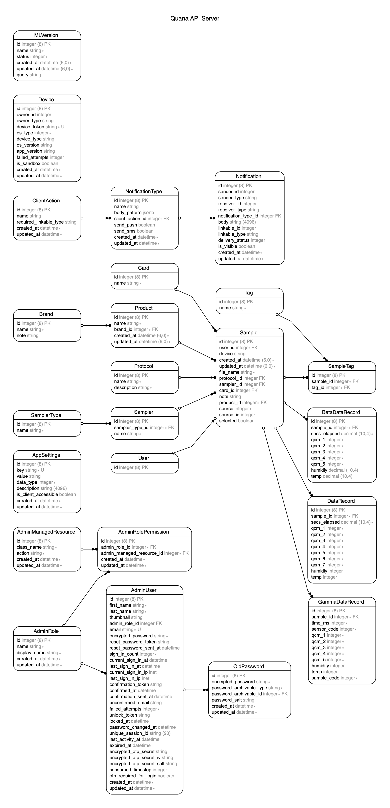

# Quana DB

#### Models Breakdown
* ML Version - Storing versions of training agents
* SamplerType - Scanning device types
* Sampler - Registered specific scanning device, used in sample
  * Belongs to - SamplerType
* Card/Tags - identities used in Samples
  * Has many - Samples
* SampleTag - connects a tags with a sample
  * Belongs to - Sample, Tag 
* Sample - represents a sample with many DataRecords, sampler, tags, card, protocol and more
  * Belongs to - Protocol, Product, Sampler, Card
  * Has Many - SampleTag
  * SampleAlpha - Has Many DataRecords
  * SampleBeta - Has Many BetaDataRecords
  * SampleGamma - Has Many GammaDataRecords
* Product - represent a product that was/can be scanned, has one Brand
* Brand - brand identity of a Product/s
* Protocol - A protocol is the instructions used to produce a sample
* DataRecord/BetaDataRecord/GammaDataRecord - represent a row inside of a sample, each table using different format, DataRecord is the oldest and GammaDataRecord is the newest, (different devices produce different formats)
* Device/Notification/NotificationType/ClientAction/User - not used
* AppSettings - settings used to control the server
* AdminRole/AdminUser/AdminRolePermission - used to store admin users/permissions/roles
* AdminManagedResource - resources an admin can get access to (models&actions)

#### Project Breakdown
* db/migrate - Database migrations
* test/* - Tests
* lib/* - inhouse libraries that are used like SMS or lib extensions
* config
* credentials - secret settings per environment (need private key to edit/view)
* enviroments - enviroment specific settings
  * initializers - libraries initializers
  * locales - translations files
  * database.yml - database config
  * routes - all REST routes in server
  * application - rails server settings
* app
  * admin - describe how pages look like in the admin panel and which actions you can do on them
  * api/channels - not used
  * assets - web assets for admin, js/css/images/etc
  * controllers - mainly MLController is used, routes configured in routes file
    * MLController:
      * upload_sample - uploads a sample to db and classify it
      * upload_white_sample - uploads a sample to db from white device and classify it
      * classify_multiple_safe - response of upload_sample, sends a classify request to agent
      * upload_white_sample - response of upload_white_sample, sends a classify request to agent
      * samples - api request from agent server, responds with all samples with specific filters, these samples are then used for learning
      * version - api request from agent server, tells the agent what version to use
      * classify_sample - classify single sample by sending it to agent server
      * train - tell the agent to train using new samples
      * update_versions - get all versions from agent
  * models - all models used in the server, most of them are simple I will only mention the important ones:
    * Sample - the base class of a Sample, its a basic interface for all kind of samples
      * data - used to get all of the sample rows
      * data_type - row type (DataRecord/BetaDataRecord/GammaDataRecord)
      * insert_sample - load rows from string or file
      * classification - sends a classification request to agent
    * AlphaSample - extends Sample, used for oldest format with DataRecord per row
    * BetaSample - extends Sample, used for old format with BetaDataRecord per row
    * GammaSample - extends Sample, used for latest format with GammaDataRecord per row
    * DataRecord/BetaDataRecord/GammaDataRecord - used to store rows of data, each model is a different format and also containts code to parse/load the data from file/string

